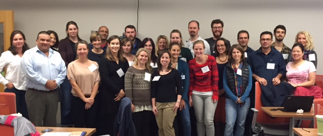

# Spatial models for distance sampling data using R and ArcGIS

This is the site for the course to be given at Duke by David L Miller and Jason Roberts 27-30 October 2015.



## Course materials

- [Slides](slides.html) in PDF, HTML and R formats
- [Practical session exercises, solutions and data](practicals.html)
- [Bibliography](bibliography.html) listing additional useful publications
- [Course `etherpad`](https://public.etherpad-mozilla.org/p/distance-duke-2015) to ask questions, give feedback and post useful links

## Course description

The workshop will cover both theory and practice and demonstrate an end-to-end workflow for spatial modelling of distance sampling data collected via line transect surveys.

Throughout the course we will follow the "density surface modelling" approach of [Hedley and Buckland (2004)](http://citeseerx.ist.psu.edu/viewdoc/download?doi=10.1.1.129.4271&rep=rep1&type=pdf), updated with methods from [Miller et al (2013)](http://onlinelibrary.wiley.com/doi/10.1111/2041-210X.12105/pdf) -- that is first modelling detectability via a detection function, then using this to create a detection-adjusted spatial model using generalized additive models (GAMs). Modelling will take place in R using packages developed by the Centre for Research into Ecological and Environmental Modelling and NOAA.

An integral part of developing these models is the management and manipulation of geospatial data. Important skills include mapping and exploring data, reformatting data for analysis, obtaining and sampling environmental predictors (e.g. from remote sensing imagery), and moving data between GIS and R. For these activities, we will use ArcGIS and the Marine Geospatial Ecology Tools (MGET) package ([Roberts et al. 2010](http://www.sciencedirect.com/science/article/pii/S1364815210000885)), developed at the Duke Marine Geospatial Ecology Lab.

## Schedule

This is a *preliminary* schedule and is subject to change.


<table>
<colgroup>
<col width="8%" />
<col width="18%" />
<col width="18%" />
<col width="18%" />
<col width="18%" />
<col width="18%" />
</colgroup>
<thead>
<tr class="header">
<th align="left">Day/Time</th>
<th align="left">Objective</th>
<th align="left">0900-1030</th>
<th align="left">1045-1215</th>
<th align="left">1315-1445</th>
<th align="left">1500-1630</th>
</tr>
</thead>
<tbody>
<tr class="odd">
<td align="left">Tuesday</td>
<td align="left">Fit detection function, estimate abundance with Horvitz-Thompson</td>
<td align="left"><strong>Classroom:</strong> Welcome, intro to distance sampling (DS)</td>
<td align="left"><strong>Lab:</strong> Introduce example data, get sightings into ArcGIS and R</td>
<td align="left"><strong>Classroom:</strong> DS covariates, variance, model checking and selection, Horvitz-Thompson</td>
<td align="left"><strong>Lab:</strong> DS practicals</td>
</tr>
<tr class="even">
<td align="left">Wednesday</td>
<td align="left">Fit and check a density surface model (DSM)</td>
<td align="left"><strong>Classroom:</strong> What is a DSM?</td>
<td align="left"><strong>Lab:</strong> Get segments into ArcGIS and R, produce prediction grid</td>
<td align="left"><strong>Classroom:</strong> Intro to generalized additive models (GAMs)</td>
<td align="left"><strong>Lab:</strong> GAM practicals, fit first DSM</td>
</tr>
<tr class="odd">
<td align="left">Thursday</td>
<td align="left">Add environmental covariates to the model</td>
<td align="left"><strong>Classroom:</strong> Adding covariates: why, how, what? Intro to environmental data</td>
<td align="left"><strong>Lab:</strong> Download and process environmental data</td>
<td align="left"><strong>Classroom:</strong> Multiple smooths, model selection</td>
<td align="left"><strong>Lab:</strong> Fit and check multivariate DSMs</td>
</tr>
<tr class="even">
<td align="left">Friday</td>
<td align="left">Produce maps of predicted abundance</td>
<td align="left"><strong>Lab:</strong> Predictions: theory and in practice</td>
<td align="left"><strong>Lab:</strong> Variance: theory and in practice</td>
<td align="left"><strong>Classroom:</strong> Advanced topics</td>
<td align="left"><strong>Classroom:</strong> Special topics and follow-up</td>
</tr>
</tbody>
</table>


## Software

Participants are encouraged to bring their own laptops to use for at least some of the workshop practicals. Both ArcGIS and R will be used, even those who do not have access to ArcGIS on their laptops will find it useful to use R on their own machines.

To ensure your computer is setup correctly prior to the workshop please check the instructions below.

### R

The course will use R, RStudio and various R packages installable from CRAN. The following steps should setup your computer for the workshop:

1. Install R from [the R website](https://cran.rstudio.com/)
2. Install RStudio from [the RStudio website](http://www.rstudio.com/products/rstudio/download/)
3. Install R packages from within R using the following command:

```{r}
install.packages(c("mrds", "Distance", "dsm", "ggplot2", "rgdal", "knitr",
                   "plyr", "raster", "reshape2", "viridis", "htmltools",
                   "caTools", "bitops", "rmarkdown", "tweedie"))
```

### ArcGIS

The course will use the MGET toolkit for ArcGIS, information on [installing the software can be found here](http://mgel.env.duke.edu/mget/download/), if you already have ArcGIS installed.


